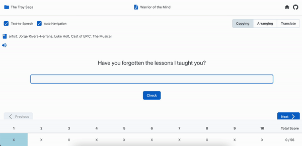

# Song Learning

Learn English with your favorite songs!

[Visit the deployed website](https://song-learning.vercel.app/)

## Overview

Song Learning is a web application that helps users improve their English language skills through music. By uploading and studying song lyrics, users can enhance their language comprehension in an enjoyable and engaging way.

## Features

|         Copy Mode          |           Arrange Mode           |            Translate Mode            |
| :------------------------: | :------------------------------: | :----------------------------------: |
|  |  |  |

- Three study modes:

  1. Copy: Practice writing by copying the lyrics
  2. Arrange: Improve comprehension by arranging shuffled lyrics
  3. Translate: Enhance vocabulary by translating lyrics

- Text-to-Speech (TTS) support for better pronunciation practice

## Try it out

**Note:** Not all song lyrics have been uploaded yet. To experience the app with a pre-loaded song, please visit:

The Troy Saga > Warrior of the mind
